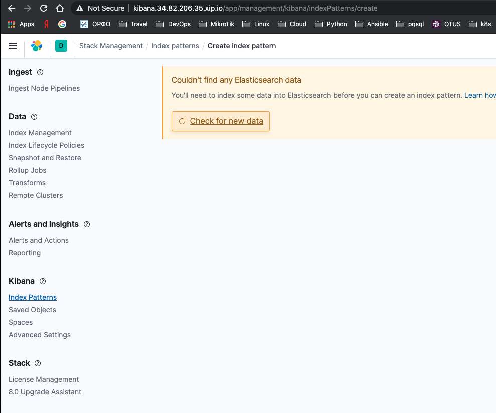
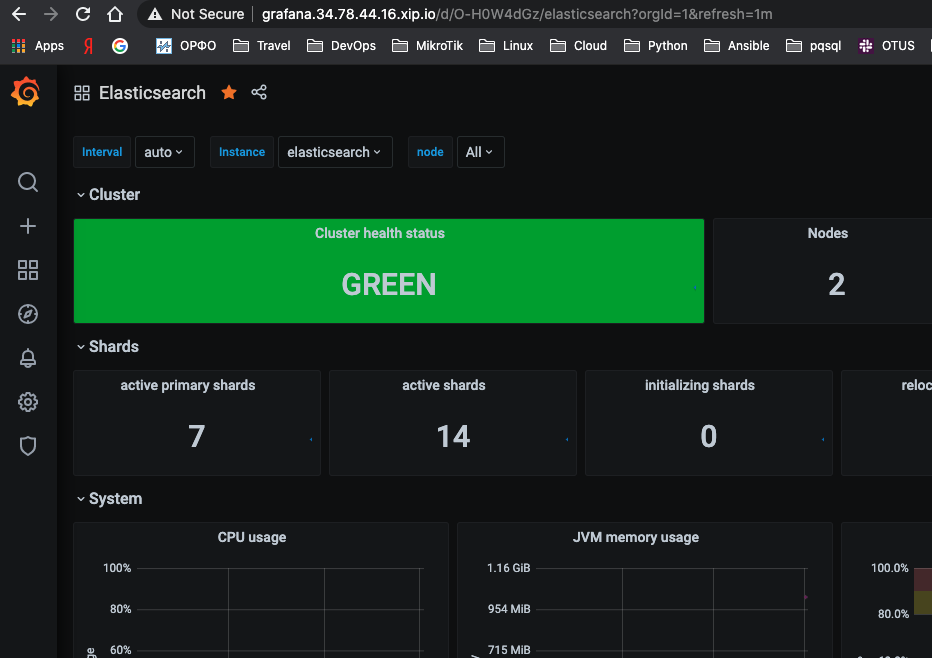

#### Выполненное Д/З №10

 - [x] Установил EFK и Grafana
 - [x] Самостоятельное задание | Установка nginx-ingress
 - [x] Установил nginx ingress
 - [x] Настроил node exporters

#### Для выполнения домашнего задания понадобится подготовка Kubernetes кластера:
Мы планируем отдать три из четырех нод кластера под инфраструктурные сервисы. Присвоим этим нодам определенный [Taints](https://kubernetes.io/docs/concepts/scheduling-eviction/taint-and-toleration/), чтобы избежать запуска на них случайных pod. Укажем следующую конфигурацию taint через web-интерфейс GCP: node-role=infra:NoSchedule (я буду назначать все через CLI).

```
gcloud compute zones list 
```

Создаем k8s: 
```
gcloud container clusters create logging-hw --num-nodes 1 \
    --zone europe-west1-b --machine-type n1-standard-2 \
    --disk-size=50GB --no-enable-stackdriver-kubernetes
``` 
Добавляем pool и node-taints в существующий k8s: 
```
gcloud container node-pools create infra-pool --cluster logging-hw --zone europe-west1-b --num-nodes 3 --machine-type n1-standard-2 --disk-size=50GB --node-taints node-role=infra:NoSchedule
```

Удаляем k8s
```
gcloud container clusters delete logging-hw --zone europe-west1-b
```
В результате должна получиться следующая конфигурация кластера:
```
kubectl get node
NAME                                        STATUS   ROLES    AGE     VERSION
gke-logging-hw-default-pool-753d6383-qxrq   Ready    <none>   2m49s   v1.15.12-gke.2
gke-logging-hw-infra-pool-48573e6a-468g     Ready    <none>   16s     v1.15.12-gke.2
gke-logging-hw-infra-pool-48573e6a-f3kw     Ready    <none>   57s     v1.15.12-gke.2
gke-logging-hw-infra-pool-48573e6a-ggzw     Ready    <none>   57s     v1.15.12-gke.2
```
#### Установка HipsterShop
Установим в Kubernetes кластер уже знакомый HipsterShop. Самый простой способ сделать это - применить подготовленный манифест: 
```
kubectl create ns microservices-demo
kubectl apply -f https://raw.githubusercontent.com/express42/otus-platformsnippets/master/Module-02/Logging/microservices-demo-without-resources.yaml -n microservices-demo

Проверим, что все pod развернулись на ноде из default-pool:
kubectl get pods -n microservices-demo -o wide
```

#### Установка EFK стека | Helm charts
В данном домашнем задании мы будет устанавливать и использовать различные решения для логирования различными способами. Начнем с "классического" набора инструментов (ElasticSearch,Fluent Bit, Kibana) и "классического" способа его установки в Kubernetes кластер (Helm).
Рекомендуемый репозиторий с Helm chart для ElasticSearch и Kibana на текущий момент - https://github.com/elastic/helm-charts

Добавим его:
```
helm repo add elastic https://helm.elastic.co
```
Запустим каждую реплику ElasticSearch на своей, выделенной ноде из infra-pool. Создадим файл [elasticsearch.values.yaml](https://github.com/otus-kuber-2020-07/LinarNadyrov_platform/blob/kubernetes-logging/kubernetes-logging/elasticsearch.values.yaml), будем указывать в этом файле нужные нам values.


Обратимся к файлу values.yaml в [репозитории](https://github.com/elastic/helm-charts/tree/master/elasticsearch) и найдем там ключ tolerations. Мы помним, что ноды из infra-pool имеют taint node-role=infra:NoSchedule. Давайте разрешим
ElasticSearch запускаться на данных нодах. Для этого внесем данные в файл [elasticsearch.values.yaml](https://github.com/otus-kuber-2020-07/LinarNadyrov_platform/blob/kubernetes-logging/kubernetes-logging/elasticsearch.values.yaml)

```
tolerations:
  - key: node-role
    operator: Equal
    value: infra
    effect: NoSchedule
```
Установим elasticsearch:
```
kubectl create ns observability
helm upgrade --install elasticsearch elastic/elasticsearch --namespace observability -f elasticsearch.values.yaml
```

Теперь ElasticSearch может запускаться на нодах из infra-pool, но это не означает, что он должен это делать.
Исправим этот момент и добавим в [elasticsearch.values.yaml](https://github.com/otus-kuber-2020-07/LinarNadyrov_platform/blob/kubernetes-logging/kubernetes-logging/elasticsearch.values.yaml) NodeSelector, определяющий, на каких нодах мы можем запускать наши pod.
```
nodeSelector:
cloud.google.com/gke-nodepool: infra-pool
```
Обновим установленный elasticsearch:
```
helm upgrade --install elasticsearch elastic/elasticsearch --namespace observability -f elasticsearch.values.yaml
```
Другой, и, на самом деле, более гибкий способ осуществить задуманное - [nodeAffinity](https://kubernetes.io/docs/concepts/scheduling-eviction/assign-pod-node/)

Должный получить следующую картину:
```
kubectl get pods -n observability -o wide -l chart=elasticsearch 
NAME                     READY   STATUS    RESTARTS   AGE   IP          NODE                                      NOMINATED NODE   READINESS GATES
elasticsearch-master-0   1/1     Running   0          56m   10.44.3.2   gke-logging-hw-infra-pool-48573e6a-468g   <none>           <none>
elasticsearch-master-1   1/1     Running   0          57m   10.44.2.2   gke-logging-hw-infra-pool-48573e6a-ggzw   <none>           <none>
elasticsearch-master-2   1/1     Running   0          59m   10.44.1.2   gke-logging-hw-infra-pool-48573e6a-f3kw   <none>           <none>
```
#### Установка nginx-ingress | Самостоятельное задание
Для того, чтобы продолжить установку EFK стека и получить доступ к Kibana, предварительно потребуется развернуть ingress-controller.

Установите nginx-ingress. Должно быть развернуто три реплики controller, по одной, на каждую ноду из infra-pool

```
kubectl create ns nginx-ingress
helm upgrade --install nginx-ingress stable/nginx-ingress --namespace=nginx-ingress --version=1.41.3 -f nginx-ingress.values.yaml
```
### ingress-controller установился, но получил такое сообщение:  
*******************************************************************************************************
* DEPRECATED, please use https://github.com/kubernetes/ingress-nginx/tree/master/charts/ingress-nginx *
*******************************************************************************************************
При инсталляции ставится ``` deployment.apps/nginx-ingress-default-backend ``` из за этого ставится 4 nginx-ingress (условию задачи это не противоречит - три реплики controller, из за этого капать не стал)
```
kubectl get all -n nginx-ingress                                                  
NAME                                                 READY   STATUS    RESTARTS   AGE
pod/nginx-ingress-controller-844dcddcc-2cm75         1/1     Running   0          55m
pod/nginx-ingress-controller-844dcddcc-72gbs         1/1     Running   0          55m
pod/nginx-ingress-controller-844dcddcc-9wstl         1/1     Running   0          55m
pod/nginx-ingress-default-backend-674d599c48-kdmwp   1/1     Running   0          15s

NAME                                    TYPE           CLUSTER-IP      EXTERNAL-IP    PORT(S)                      AGE
service/nginx-ingress-controller        LoadBalancer   10.47.251.139   34.82.206.35   80:30160/TCP,443:30126/TCP   55m
service/nginx-ingress-default-backend   ClusterIP      10.47.250.154   <none>         80/TCP                       55m

NAME                                            READY   UP-TO-DATE   AVAILABLE   AGE
deployment.apps/nginx-ingress-controller        3/3     3            3           55m
deployment.apps/nginx-ingress-default-backend   1/1     1            1           55m

NAME                                                       DESIRED   CURRENT   READY   AGE
replicaset.apps/nginx-ingress-controller-844dcddcc         3         3         3       55m
replicaset.apps/nginx-ingress-default-backend-674d599c48   1         1         1       55m
```

#### Установка EFK стека | Kibana
Создадим файл [kibana.values.yaml](https://github.com/otus-kuber-2020-07/LinarNadyrov_platform/blob/kubernetes-logging/kubernetes-logging/kibana.values.yaml) и добавим туда конфигурацию для создания ingress: 
```
ingress:
  enabled: true
  annotations: {
    kubernetes.io/ingress.class: nginx
  }
  path: /
  hosts:
    - kibana.34.82.206.35.xip.io
```

Обновим релиз:
```
helm upgrade --install kibana elastic/kibana --namespace observability -f kibana.values.yaml
```
После прохождения всех предыдущих шагов у вас должен появиться доступ к Kibana по URL kibana.<YOUR_IP>.xip.io
Попробуем создать index pattern, и увидим, что в ElasticSearch пока что не обнаружено никаких данных:



За отправку логов отвечает Fluent Bit. Создадим файл [fluent-bit.values.yaml](https://github.com/otus-kuber-2020-07/LinarNadyrov_platform/blob/kubernetes-logging/kubernetes-logging/fluent-bit.values.yaml) и добавим туда: 
```
backend:
  type: es
  es:
    host: elasticsearch-master
```
Установим/обновим релиз:
```
helm upgrade --install fluent-bit stable/fluent-bit --namespace observability -f fluent-bit.values.yaml
```
Лог файл можно посмотреть: 
```
kubectl get pods -A -o wide | grep "flue" 
kubectl logs fluent-bit-wp6zt -n observability --tail 2
```
Попробуем повторно создать index pattern. В этот раз ситуация изменилась, и какие-то индексы в ElasticSearch уже есть. 

После установки можно заметить, что в ElasticSearch попадают далеко не все логи нашего приложения. Причину можно найти в логах pod с Fluent Bit, он пытается обработать JSON, отдаваемый приложением, и находит там дублирующиеся поля time и timestamp. 

GitHub [issue](https://github.com/fluent/fluent-bit/issues/628), с более подробным описанием проблемы

Для решения проблемы мы пойдем сложным путем и воспользуемся фильтром [Modify](https://docs.fluentbit.io/manual/pipeline/filters/modify), который позволит удалить из логов "лишние" ключи. 

Добавим в файл [fluent-bit.values.yaml](https://github.com/otus-kuber-2020-07/LinarNadyrov_platform/blob/kubernetes-logging/kubernetes-logging/fluent-bit.values.yaml) следующие данные: 
```
backend:
  type: es
  es:
    host: elasticsearch-master
rawConfig: |
  @INCLUDE fluent-bit-service.conf
  @INCLUDE fluent-bit-input.conf
  @INCLUDE fluent-bit-filter.conf
  @INCLUDE fluent-bit-output.conf

  [FILTER]
    Name   modify
    Match  *
    Remove time
    Remove @timestamp
```

Проверим результат: 
```
helm upgrade --install fluent-bit stable/fluent-bit --namespace observability -f fluent-bit.values.yaml
kubectl logs fluent-bit-hcrqm -n observability --tail 2
```
#### Мониторинг ElasticSearch
Для мониторинга ElasticSearch будем использовать Prometheus exporter.

Создадим файл [prometheus-operator.values.yaml](https://github.com/otus-kuber-2020-07/LinarNadyrov_platform/blob/kubernetes-logging/kubernetes-logging/prometheus-operator.values.yaml) и установим prometheus-operator в namespace observability: 
```
helm upgrade --install prometheus choerodon/kube-prometheus -n observability -f prometheus-operator.values.yaml
```

Установим Prometheus exporter:
```
helm upgrade --install elasticsearch-exporter stable/elasticsearch-exporter --set es.uri=http://elasticsearch-master:9200 --set serviceMonitor.enabled=true --namespace=observability
```

Импортируйте в Grafana один из популярных [Dashboard](https://grafana.com/grafana/dashboards/4358) для ElasticSearch exporter, содержащий визуализацию основных собираемых метрик. 

Получаем результат:



Проверим, что метрики действительно собираются корректно. Сделайте drain одной из нод infra-pool. Статус Cluster Health остался зеленым, но количество нод в кластере уменьшилось до двух штук. При этом, кластер сохранил полную работоспособность. Попробуем сделать drain второй ноды из infra-pool, и увидим что [PDB](https://kubernetes.io/docs/tasks/run-application/configure-pdb/) не дает этого сделать.


Рассмотрим некоторое количество ключевых метрик, которые рекомендуется отслеживать при эксплуатации ElasticSearch:

###### unassigned_shards - количество shard, для которых не нашлось подходящей ноды, их наличие сигнализирует о проблемах
###### jvm_memory_usage - высокая загрузка (в процентах от выделенной памяти) может привести к замедлению работы кластера
###### number_of_pending_tasks*** - количество задач, ожидающих выполнения. Значение метрики, отличное от нуля, может сигнализировать о наличии проблем внутри кластера
----
----

#### Как запустить данную ДЗ (выполняется пошагово)
Создаем k8s: 
```
gcloud container clusters create logging-hw --num-nodes 1 \
    --zone europe-west1-b --machine-type n1-standard-2 \
    --disk-size=50GB --no-enable-stackdriver-kubernetes
``` 
Добавляем pool и node-taints в существующий k8s: 
```
gcloud container node-pools create infra-pool --cluster logging-hw --zone europe-west1-b --num-nodes 3 --machine-type n1-standard-2 --disk-size=50GB --node-taints node-role=infra:NoSchedule
```

Установим elasticsearch:
```
kubectl create ns observability
helm upgrade --install elasticsearch elastic/elasticsearch --namespace observability -f elasticsearch.values.yaml
```
Установим fluent-bit:
```
helm upgrade --install fluent-bit stable/fluent-bit --namespace observability -f fluent-bit.values.yaml
```

Установим prometheus-operator в namespace observability: 
```
helm upgrade --install prometheus choerodon/kube-prometheus -n observability -f prometheus-operator.values.yaml
```

Установим Prometheus exporter:
```
helm upgrade --install elasticsearch-exporter stable/elasticsearch-exporter --set es.uri=http://elasticsearch-master:9200 --set serviceMonitor.enabled=true --namespace=observability
```

Установите nginx-ingress:
```
kubectl create ns nginx-ingress
helm upgrade --install nginx-ingress stable/nginx-ingress --namespace=nginx-ingress --version=1.41.3 -f nginx-ingress.values.yaml
```

Обновим prometheus-operator
```
helm upgrade --install prometheus choerodon/kube-prometheus -n observability -f prometheus-operator.values.yaml
```
Обновим elasticsearch:
```
helm upgrade --install elasticsearch elastic/elasticsearch --namespace observability -f elasticsearch.values.yaml
```

Установите kibana:
```
helm upgrade --install kibana elastic/kibana --namespace observability -f kibana.values.yaml
```
----
