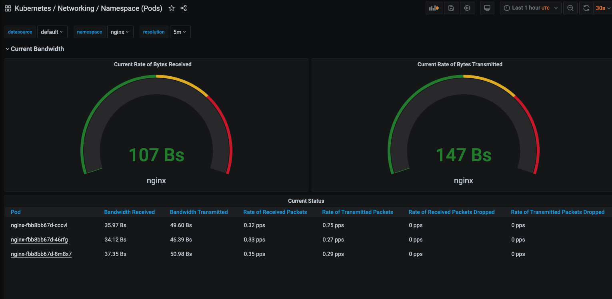
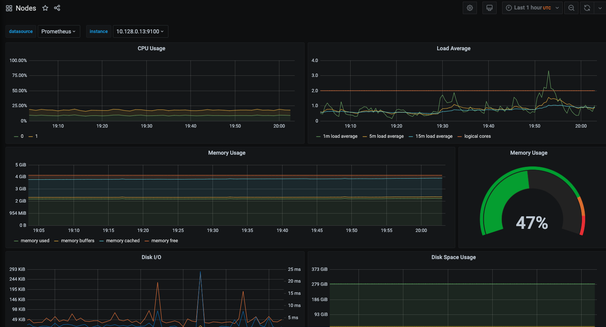

##### Необходимо создать кастомный образ nginx. (Базовый образ не важен) Который по определенному пути будет отдавать свои метрики. Далее необходимо использовать nginx exporter который будет преобразовывать эти метрики в формат понятный prometheus.

##### Результатом выполненого дз будут являться deployment, service, servicemonitor для nginx и nginx exporter в зависимости от варианта который Вы выберете.

##### Устанавливаем prometheus-operator/kube-prometheus
```
kubectl create ns monitoring
helm repo add choerodon https://openchart.choerodon.com.cn/choerodon/c7n
helm repo update
helm upgrade --install prometheus choerodon/kube-prometheus --version 9.3.1 -n monitoring \
 --set prometheus.prometheusSpec.serviceMonitorSelectorNilUsesHelmValues=false \
 --set prometheus.prometheusSpec.podMonitorSelectorNilUsesHelmValues=false
```
prometheus.prometheusSpec.serviceMonitorSelectorNilUsesHelmValues=false - зачем это нужно написано [тут](https://hub.helm.sh/charts/choerodon/kube-prometheus)

prometheus.prometheusSpec.podMonitorSelectorNilUsesHelmValues=false - так зачем это написано [тут](https://hub.helm.sh/charts/choerodon/kube-prometheus)


##### Создаем кастомный образ nginx с nginx-exporter и запускаем его
```
kubectl create ns nginx
kubectl apply -f nginx.yaml
```

##### Запускаем servicemonitor
```
kubectl apply -f ServiceMonitor.yaml
```

##### Данные можно посмотреть
```
kubectl -n monitoring port-forward --address 0.0.0.0 pod/prometheus-prometheus-kube-prometheus-prometheus-0 9090:9090
kubectl -n monitoring port-forward --address 0.0.0.0 pod/prometheus-grafana-5558455c66-9qw5l 3000:3000
```

##### Получаются красивые изображения
Granafa nginx 



Granafa node



